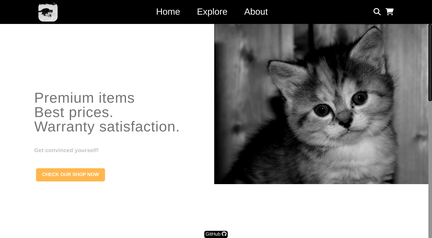

# TOP - Shopping cart
This shopping cart was created using `react-router-dom` to enable "client side routing".

It also uses `react-query` to fetch fake store items and `Tailwind CSS` to add styles.

To populate some product data we used [fake store API](https://fakestoreapi.com/)